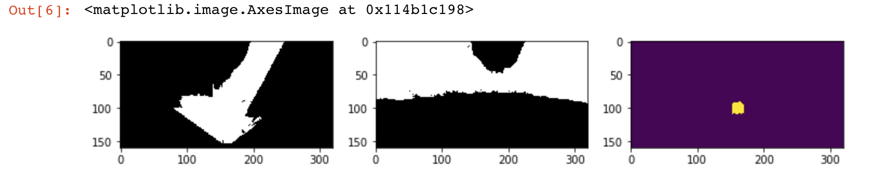
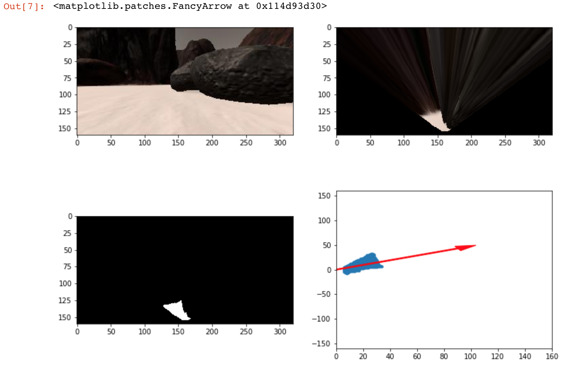
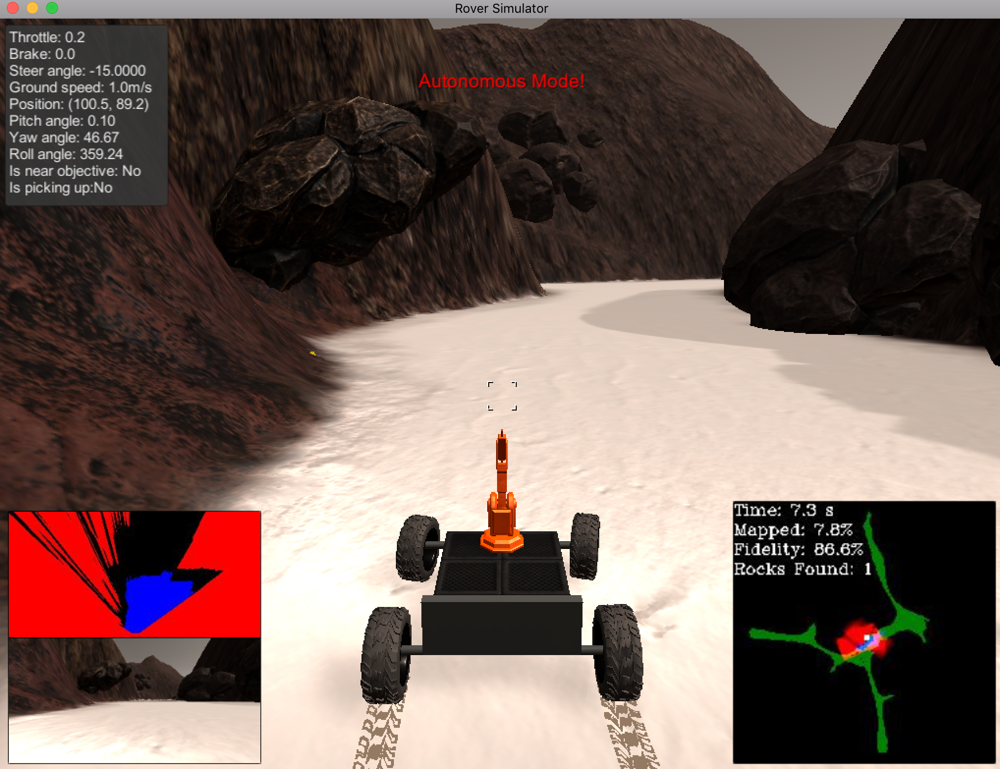
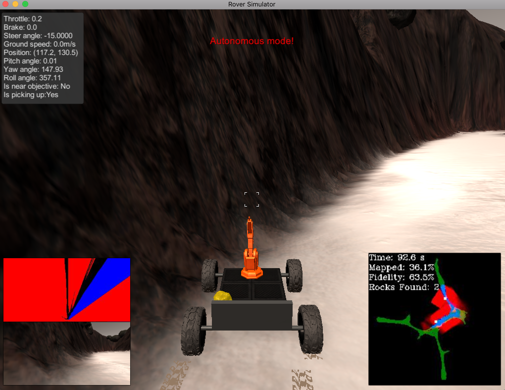

## Project: Search and Sample Return

---


**The goals / steps of this project are the following:**  

**Training / Calibration**  

* Download the simulator and take data in "Training Mode"
* Test out the functions in the Jupyter Notebook provided
* Add functions to detect obstacles and samples of interest (golden rocks)
* Fill in the `process_image()` function with the appropriate image processing steps (perspective transform, color threshold etc.) to get from raw images to a map.  The `output_image` you create in this step should demonstrate that your mapping pipeline works.
* Use `moviepy` to process the images in your saved dataset with the `process_image()` function.  Include the video you produce as part of your submission.

**Autonomous Navigation / Mapping**

* Fill in the `perception_step()` function within the `perception.py` script with the appropriate image processing functions to create a map and update `Rover()` data (similar to what you did with `process_image()` in the notebook). 
* Fill in the `decision_step()` function within the `decision.py` script with conditional statements that take into consideration the outputs of the `perception_step()` in deciding how to issue throttle, brake and steering commands. 
* Iterate on your perception and decision function until your rover does a reasonable (need to define metric) job of navigating and mapping.  

[//]: # (Image References)

[image1]: ./misc/rover_image.jpg
[image2]: ./calibration_images/example_grid1.jpg
[image3]: ./calibration_images/example_rock1.jpg 

## [Rubric](https://review.udacity.com/#!/rubrics/916/view) Points
### Here I will consider the rubric points individually and describe how I addressed each point in my implementation.  

---
### Writeup / README

#### 1. Provide a Writeup / README that includes all the rubric points and how you addressed each one.  You can submit your writeup as markdown or pdf.  

New methods for identifying obstacles and rocks were added as can be reffered with cell 6 in notebook.

````
#inverting the color for obstracles
def obstacles(img, rgb_thresh=(70, 70, 70)):
    obstacles = np.zeros_like(img[:,:,0])
    below_thresh = (img[:,:,0] < rgb_thresh[0]) \
                & (img[:,:,1] < rgb_thresh[1]) \
                & (img[:,:,2] < rgb_thresh[2])
    obstacles[below_thresh] = 1
    return obstacles
````
In finding the obstacle, the same technique is used as for finding the navigable terrain, just,
the image threshold is inverted.

````
#imposing a lower and upper boundary in your color selection to be more specific about choosing colors
def rocks(img):
    low_yellow = np.array([20, 100, 100], dtype = "uint8")
    high_yellow = np.array([255, 255, 255], dtype = "uint8")
    
    # convert to HSV space for better detection of yellow color
    img_hsv = cv2.cvtColor(img, cv2.COLOR_RGB2HSV,3)
    # mask yellow values
    mask_rock = cv2.inRange(img_hsv, low_yellow, high_yellow)
    return mask_rock


````
For finding the rocks, the cv2 library for changing the color space was used, we experimented with 
different color space, like YUV, YCbCr and HSV. all these color space was providing better classification of yellow rocks than RGB. I choose HSV as classification was simple and yet clear as can bee seen in 
these images below.



and the rotations and translation methods were implemented, which provides, better rover image and navigation angle.
the same methods later used for calculating the position of obstacles , rock and navigable area with respect to rover's perspective and mapping with world.



#### 2. Populate the `process_image()` function with the appropriate analysis steps to map pixels identifying navigable terrain, obstacles and rock samples into a worldmap.  Run `process_image()` on your test data using the `moviepy` functions provided to create video output of your result. 


The `process_image()` function to complete the perception y the rover, by finding the relative world position of obstracles, rocks and rover itself. as can be seen in cell 21 in notebook.

````
 # 1) Define source and destination points for perspective transform
    dst_size = 5 
    bottom_offset = 6
    source = np.float32([[14, 140], [301 ,140],[200, 96], [118, 96]])
    destination = np.float32([[img.shape[1]/2 - dst_size, img.shape[0] - bottom_offset],
                  [img.shape[1]/2 + dst_size, img.shape[0] - bottom_offset],
                  [img.shape[1]/2 + dst_size, img.shape[0] - 2*dst_size - bottom_offset], 
                  [img.shape[1]/2 - dst_size, img.shape[0] - 2*dst_size - bottom_offset],
                  ])
    
    # 2) Apply perspective transform
    warped = perspect_transform(image, source, destination)
    # 3) Apply color threshold to identify navigable terrain/obstacles/rock samples
    
    colorsel_terrain = color_thresh(warped, rgb_thresh=(160, 160, 160))
    threshed_obstacles = obstacles(warped)
    threshed_rocks = rocks(warped)
    
    # 4) Convert thresholded image pixel values to rover-centric coords
    
    terrain_xpix, terrain_ypix = rover_coords(colorsel_terrain)
    obstacles_xpix, obstacles_ypix = rover_coords(threshed_obstacles)
    rocks_xpix, rocks_ypix = rover_coords(threshed_rocks)
    
    # 5) Convert rover-centric pixel values to world coords
    
    dist, angles = to_polar_coords(terrain_xpix, terrain_ypix)
    
    # 6) Update worldmap (to be displayed on right side of screen)
        # Example: data.worldmap[obstacle_y_world, obstacle_x_world, 0] += 1
        #          data.worldmap[rock_y_world, rock_x_world, 1] += 1
        #          data.worldmap[navigable_y_world, navigable_x_world, 2] += 1
    scale = 10
    navigable_x_world, navigable_y_world = pix_to_world(terrain_xpix, terrain_ypix, 
                                    data.xpos[data.count], data.ypos[data.count],  data.yaw[data.count],
                                    data.worldmap.shape[0], scale)
    
    obstacle_x_world, obstacle_y_world = pix_to_world(obstacles_xpix, obstacles_ypix,
                                                        data.xpos[data.count], data.ypos[data.count], data.yaw[data.count],
                                                        data.worldmap.shape[0], scale)
    
    rock_x_world, rock_y_world = pix_to_world(rocks_xpix, rocks_ypix, 
                                              data.xpos[data.count], data.ypos[data.count], data.yaw[data.count], 
                                              data.worldmap.shape[0], scale) 
    
    
    data.worldmap[obstacle_y_world, obstacle_x_world, 0] += 1
    data.worldmap[rock_y_world, rock_x_world, 1] += 1
    data.worldmap[navigable_y_world, navigable_x_world, 2] += 1
````

the result can be seen in output test_mapping.mp4 file.

### Autonomous Navigation and Mapping

#### 1. Fill in the `perception_step()` (at the bottom of the `perception.py` script) and `decision_step()` (in `decision.py`) functions in the autonomous mapping scripts and an explanation is provided in the writeup of how and why these functions were modified as they were.

the perception step was completed with the similar idea of test done in notebook, along with update of the Rover vision and Rover's world map.

the `rotate_pix` and `translate_pix` functions were calculated to calculate the rovers perspective correctly.

````
def rotate_pix(xpix, ypix, yaw):
    # TODO:
    # Convert yaw to radians
    # Apply a rotation
    yaw_rad = yaw * np.pi / 180
    xpix_rotated = (xpix * np.cos(yaw_rad)) - (ypix * np.sin(yaw_rad))
                            
    ypix_rotated = (xpix * np.sin(yaw_rad)) + (ypix * np.cos(yaw_rad))
    
    #xpix_rotated = 0
    #ypix_rotated = 0
    # Return the result  
    return xpix_rotated, ypix_rotated

# Define a function to perform a translation
def translate_pix(xpix_rot, ypix_rot, xpos, ypos, scale): 
    # TODO:
    # Apply a scaling and a translation
    #xpix_translated = 0
    #ypix_translated = 0
    xpix_translated = (xpix_rot / scale) + xpos
    ypix_translated = (ypix_rot / scale) + ypos
    # Return the result  
    return xpix_translated, ypix_translated
    
````
the images and other data like the position and yaw angle was taken from Rover telemetry data itself, so
the functions were modified accordingly.


````
    # 1) Define source and destination points for perspective transform
    dst_size = 5 
    bottom_offset = 6
    source = np.float32([[14, 140], [301 ,140],[200, 96], [118, 96]])
    destination = np.float32([[Rover.img.shape[1]/2 - dst_size, Rover.img.shape[0] - bottom_offset],
                  [Rover.img.shape[1]/2 + dst_size, Rover.img.shape[0] - bottom_offset],
                  [Rover.img.shape[1]/2 + dst_size, Rover.img.shape[0] - 2*dst_size - bottom_offset], 
                  [Rover.img.shape[1]/2 - dst_size, Rover.img.shape[0] - 2*dst_size - bottom_offset],
                  ])
    
    # 2) Apply perspective transform
    warped = perspect_transform(Rover.img, source, destination)
    # 3) Apply color threshold to identify navigable terrain/obstacles/rock samples
    
    colorsel_terrain = color_thresh(warped, rgb_thresh=(160, 160, 160))
    threshed_obstacles = obstacles(warped)
    threshed_rocks = rocks(warped)
    
    # 4) Update Rover.vision_image (this will be displayed on left side of screen)
        # Example: Rover.vision_image[:,:,0] = obstacle color-thresholded binary image
        #          Rover.vision_image[:,:,1] = rock_sample color-thresholded binary image
        #          Rover.vision_image[:,:,2] = navigable terrain color-thresholded binary image
        
    Rover.vision_image[:,:,0] = threshed_obstacles * 255
    Rover.vision_image[:,:,1] = threshed_rocks * 255
    Rover.vision_image[:,:,2] = colorsel_terrain * 255    

    # 5) Convert map image pixel values to rover-centric coords
    
    terrain_xpix, terrain_ypix = rover_coords(colorsel_terrain)
    obstacles_xpix, obstacles_ypix = rover_coords(threshed_obstacles)
    rocks_xpix, rocks_ypix = rover_coords(threshed_rocks)
   
```` 

Now for decision steps, it was challenging to find the correct combination of rules for exploration, picking up the rocks etc. 
however, for doing it manually, tried to add few conditions for picking up the rock, but still model is not too accurate.

````
   
        if Rover.mode == 'forward': 
            # Check the extent of navigable terrain
            if Rover.rock_angles is not None and len(Rover.rock_angles) > 0 :
                Rover.steer = np.clip(np.mean(Rover.rock_angles * 180/np.pi), -15, 15)
                #print('rock angle ' + Rover.steer)
                #Rover.throttle = Rover.throttle-1
                #Rover.brake = Rover.brake_set
                if Rover.near_sample:
                    Rover.mode == 'pickup'
                    Rover.brake = Rover.brake_set
                    Rover.send_pickup = True
                    Rover.steer = np.clip(np.mean(Rover.nav_angles * 180/np.pi), -15, 15)
                    Rover.pick_up = False
                    #Rover.picking_up = 0
                    #Rover.mode == 'stop'
                    Rover.brake = 0
                    Rover.throttle = Rover.throttle_set
                if Rover.vel > 1:
                    #Rover.throttle = 0
                    Rover.brake = Rover.brake_set
                else:
                    Rover.throttle = 1
                    Rover.brake = 0
                    Rover.mode == 'forward'
                    #Rover.steer = np.clip(np.mean(Rover.nav_angles * 180/np.pi), -15, 15)

````


#### 2. Launching in autonomous mode your rover can navigate and map autonomously.  Explain your results and how you might improve them in your writeup.  

The better approach could had been to train a deep learning model by providing the simulated test data to let neural network comes up with better
decision function.
as the current implemented method is not very efficient, in exploring, few occasions it refuses to move,(need to check for corner cases).



![alt text][image3]



